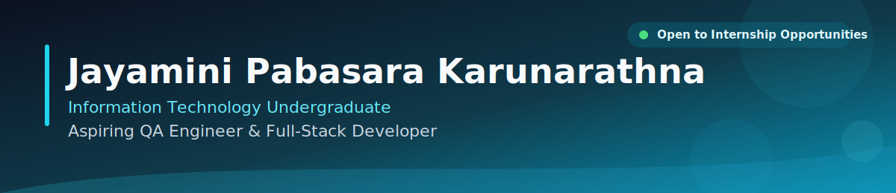

  
  
  

 

## 👩‍💻 About Me

- 🎓 **BSc (Hons) in Information Technology** undergraduate at the **Sri Lanka Institute of Information Technology (SLIIT)** — expected 2027
- 🌐 Specialized in **full-stack web development** with the **MERN stack**, **Spring Boot**, **Java**, and **MySQL**
- 🧪 Passionate about building **scalable, reliable applications** and strengthening software quality through hands-on testing with **Postman** and **Playwright**
- 📱 Also experienced in **Android app development** using **Kotlin** and **Android Studio**
- 🌱 Currently sharpening my full-stack skills through a structured program at **Skyrek**
- 🎯 Actively looking for a **Software Engineering / Web Development internship**
- 📍 Based in Malabe, Sri Lanka

 

## 🛠️ Tech Stack

<h3>💻 Programming Languages</h3>

  
  
  
  
  
  

<h3>🌐 Frontend Development</h3>

  
  
  
  

<h3>⚙️ Backend Development</h3>

  
  
  
  

<h3>📱 Mobile Development</h3>

  
  

<h3>🗄️ Databases</h3>

  
  

<h3>🧰 Developer Tools</h3>

  
  
  
  
  
  
  

 

## 🚀 Featured Projects

<table>
  <tr>
    <td width="50%" valign="top">
      <h3>🏫 Campus Core Hub</h3>
      <i>Smart Campus Operation Hub</i>
      
A smart campus management platform that improves campus operations and student services, featuring booking management and conflict-checking for resource scheduling. REST APIs were integrated and tested using Postman.

      
      
      
      
    </td>
    <td width="50%" valign="top">
      <h3>🍽️ Uni Serve</h3>
      <i>Canteen Pre-Order & Crowd Control System</i>
      
A canteen pre-order system with slot-based crowd management to reduce congestion and improve ordering efficiency, including booking management for food order reservations.

      
      
      
      
      
    </td>
  </tr>
  <tr>
    <td width="50%" valign="top">
      <h3>📚 IT GURU</h3>
      <i>Online E-Tutoring Platform</i>
      
A role-based e-learning platform for students, teachers, and administrators, with timetable management and student performance modules built using full CRUD functionality.

      
      
      
      
      
    </td>
    <td width="50%" valign="top">
      <h3>💪 HealthyYou</h3>
      <i>Daily Health & Wellness Mobile App</i>
      
An Android application for tracking daily health and wellness activities, built with a clean and accessible user interface.

      
      
    </td>
  </tr>
  <tr>
    <td width="50%" valign="top">
      <h3>🐾 Little Paws</h3>
      <i>Pet Care Mobile App</i>
      
Designed the app's UI in Figma and developed the Android application using Kotlin, focused on a smooth and intuitive user experience.

      
      
      
    </td>
    <td width="50%" valign="top">
      <h3>🏷️ Bid Magnet</h3>
      <i>Online Bidding System</i>
      
An online bidding platform built using core object-oriented programming concepts in Java, with bid placement functionality backed by a MySQL database.

      
      
      
    </td>
  </tr>
</table>

📂 More Projects

 

**Online Job Portal** — A web-based job portal with job application submission and management functionality, built with HTML, CSS, JavaScript, and MySQL via XAMPP.

 

## 📊 GitHub Analytics

  

  <picture>
    <source media="(prefers-color-scheme: dark)" srcset="https://raw.githubusercontent.com/Jayamini127/Jayamini127/output/github-contribution-grid-snake-dark.svg" />
    <source media="(prefers-color-scheme: light)" srcset="https://raw.githubusercontent.com/Jayamini127/Jayamini127/output/github-contribution-grid-snake.svg" />
    
  </picture>

  
  

  

  

 

## 📜 Certifications

| Certification | Provider | Year |
|---|---|---|
| MongoDB Node.js Developer Path | MongoDB | 2026 |
| Full-Stack Web Development *(in progress)* | Skyrek | 2026 – Present |
| Advanced Diploma in English | Beeline English Academy | 2024 |

 

### 📫 Let's Connect

I'm always open to discussing new projects, internship opportunities, or just chatting about tech!

📧 **jayaminipabasara127@gmail.com**

